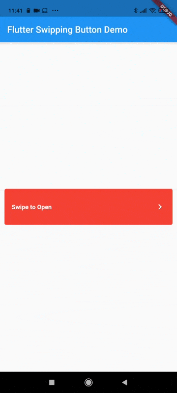

# flutter_swipping_button



A simple swipping button for Flutter with rollback animation with a desired delay.

[](https://pub.dev/packages/flutter_swipping_button)

## Getting Started

In the `pubspec.yaml` of your flutter project, add the following dependency:

```yaml
dependencies:
  ...
  flutter_swipping_button: ^1.0.0
```

In your library add the following import:

```dart
import 'package:flutter_swipping_button/flutter_swipping_button.dart';
```

For help getting started with Flutter, view the online [documentation](https://flutter.io/).

## Changelog

Please see the [Changelog](https://github.com/amarin95/flutter-swipping-button/blob/main/CHANGELOG.md) page to know what's recently changed.

## Contributions

Feel free to contribute to this project.

If you find a bug or want a feature, but don't know how to fix/implement it, please fill an [issue](https://github.com/amarin95/flutter-swipping-button/issues).  
If you fixed a bug or implemented a feature, please send a [pull request](https://github.com/amarin95/flutter-swipping-button/pulls).
